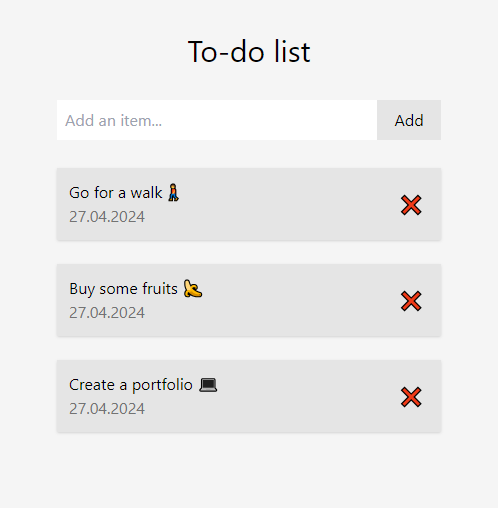

  <h1>go-htmx-todo</h1>

   \
  A todo app made using HTMX and Go
<!-- Badges -->

##

### 🤔 Why?

I stumbled upon some videos covering htmx and got interested. Turns out it is often paired with Go, which I'm learning, so I decided to give it a try! \
Because of lack of tutorials on htmx, it quite was an average experience. I learned that its the best to stick to react and other mainstream frameworks. 😃 \
_(I still love Go tho! 💗)_

<!-- TechStack -->
### 🚀 Tech Stack

### 🛠️ Building
Just copy the repo and run: \
`go build main.go`

<!-- Contact -->
## 🤝🏻 Contact
Discord - @christhefrog
